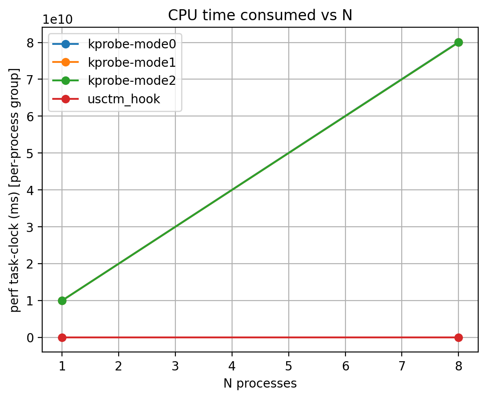
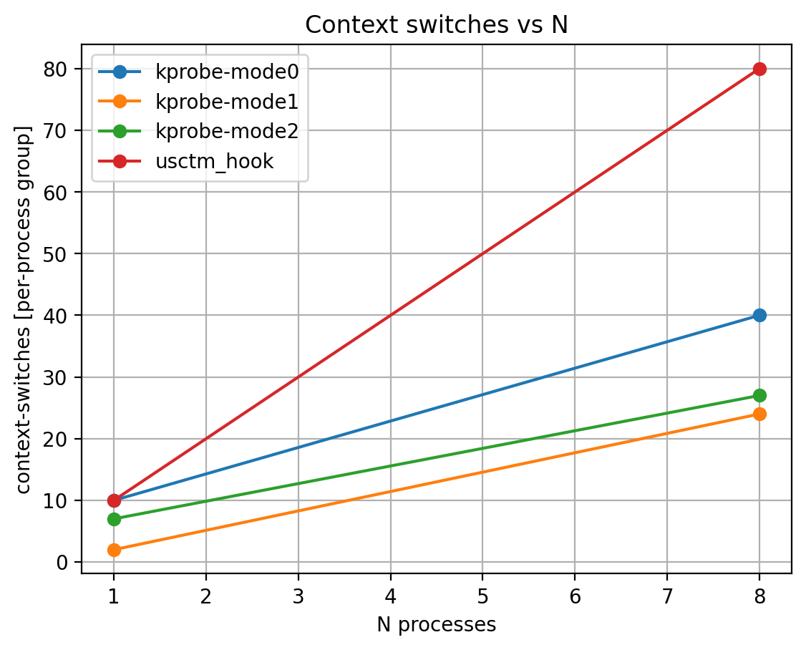
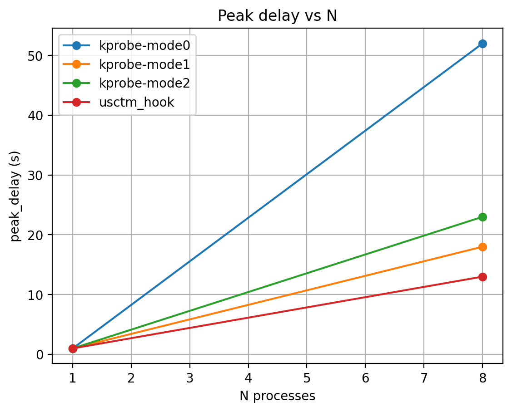
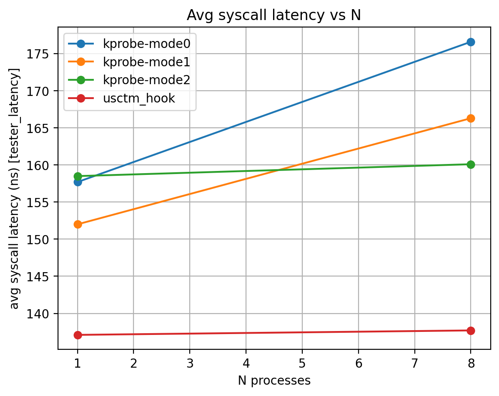

# Syscall Throttling LKM


Questa repository contiene **due implementazioni** di un servizio di *syscall throttling* tramite un **LKM - Linux Kernel Module** utilizzando la stessa interfaccia utente, `/dev/scth` con `ioctl()` tramite `scthctl`, ma con meccanismi di implementativi diversi:

- **`syscall_throttle/`**: questa intercetta le syscall tramite **kprobe** considerando anche 3 diverse modalità di utilizzo, mode0/mode1/mode2;
- **`syscall_throttle_usctm/`**: intercetta le syscall tramite una **patch della sys_call_table** usando il modulo di supporto `the_usctm`.

Sono inclusi:
- script di benchmark considerando perf/pidstat e tester_latency;
- script che considerano dei corner cases;
- scritp che eseguono dei test generali per testare le funzionalità offerte dalla logica di entrambe le versioni del modulo;
- tool di estrazione risultati, `tools/extract_bench_results.py`, per generare CSV e plot.

---

## 1. Obiettivo

Limitare il **numero massimo di invocazioni al secondo**, espresso dal valore di **MAX**, di **specifiche syscall** registrate ma **solo** quando invocate da un insieme di *program name* (`comm`) registrati **e/o** un insieme di UID effettivi (`euid`) registrati.

Il throttling applica un **budget globale per epoca**, epoca di 1 secondo, condiviso fra:
- tutti i processi;
- tutte le syscall registrate;
- tutte le entità che matchano il filtro:

```
(syscall ∈ sys_set) AND ((comm ∈ prog_set) OR (euid ∈ uid_set))
```

---

## 2. Struttura della repository

- `syscall_throttle/`  
  - `kernel/`: modulo kprobe;
  - `user/`: `scthctl` interfaccia utente, `tester_getpid`/`tester_openat`/`tester_latency` file utilizzati in fase di testing delle funzionalità;
  - `scripts/`: `bench_kprobe.sh`, `corner_cases_kprobe.sh`, script per l'esecuizone dei test;
  - `results/`: output grezzi dei benchmark.

- `syscall_throttle_usctm/`
  - `kernel/`: modulo sys_call_table hook;
  - `syscall_table_discoverer/`: supporto `the_usctm` e discovery sys_call_table;
  - `user/`, `scripts/`, `results/`: analoghi al caso kprobe.

- `tools/extract_bench_results.py`: parsing risultati e generazione CSV/plot;
- `bench_summary_final/`: output finali già estratti contenenti i file CSV con i grafici per i confronti delle prestazioni plot.

---

## 3. Interfaccia utente 

L'interfaccia utente utilizzata per le due versioni condivide molti aspetti in comune, differisce in alcune parti per poter utilizzare le funzionalità offerte da modulo. Il device `/dev/scth` accetta comandi via `ioctl()` tramite `scthctl`:

- `addprog <comm>` / `delprog <comm>`;
- `adduid <uid>` / `deluid <uid>`;
- `addsys <nr>` / `delsys <nr>`;
- `setmax <max_per_sec>` 
  - **scelta progettuale**: `0` viene **impostato ad 1** per evitare uno “deny-all”;
- `on` / `off`;
- `stats` / `resetstats`;
- `listprog` / `listuid` / `listsys`.

**Root-only per le operazioni privilegiate**: anche se il device può essere `0666`, in-kernel si applica check sul chiamante in modo tale che solo l'utente `root` possa eseguire le operazioni di inserimento/cancellazione di syscall/prigamma/uid da considerare per il controllo e per il valore di **MAX** da considerare.

---

## 4. Design comune: budget globale per epoca

### 4.1 Stato e contatori principali
- `g_monitor_on`: abilita/disabilita throttling;
- `g_max_current`: MAX effettivo dell’epoca corrente;
- `g_max_next`: MAX applicato al prossimo *rollover*;
- `win_count`: token consumati nell’epoca corrente.

Con *rollover* si indica il boundary tra le finestre da 1s, in particolare per il reset del budget, applicazione del valore di **MAX** per la prossima epoca, aggiornamento statistiche e il wakeup dei waiters.

### 4.2 Deferred MAX, stabilità intra-epoca
`setmax` aggiorna **solo** `g_max_next`. Il passaggio a `g_max_current` avviene **solo** al boundary di epoca.

Corner case verificato con gli script:
- subito dopo `setmax`, `max_current` resta invariato
- dopo rollover, `max_current = max_next`

Questo evita cambiamenti a metà finestra e rende più interpretabili le metriche, in particolare il comportamento dei waiters.

---

## 5. Implementazione 1: KPROBE, `syscall_throttle/`

Intercettazione tramite kprobe su entry della syscall, e/o handler legati al punto di aggancio.  
Quando il budget per l'epoca è finito, il comportamento dipende dalla modalità,  *mode* 0/1/2, e può includere attesa attiva, spin/yield.

**Effetto pratico**: in alcuni stress test con un valore di **MAX** molto basso e con tanti thread utilizzati, la variante con attesa attiva può causare warning tipo:

- `watchdog: BUG: soft lockup ...`

Questo è l’effetto di thread che restano troppo a lungo in kernel path senza cedere CPU.

Dettagli e riferimenti: `syscall_throttle/README.md`.

---

## 6. Implementazione 2: sys_call_table hook, `syscall_throttle_usctm/`

- Ottiene `sys_call_table` tramite `the_usctm`, symbol_get, o fallback sysfs;
- `addsys` patcha `sys_call_table[nr]` verso uno stub (`scth_stub`) e salva l’originale;
- lo stub applica match con throttle e poi richiama l’originale;
- attesa **sleeping** tramite `waitqueue` in modo tale da avere un consumo CPU molto ridotto.

Dettagli e riferimenti: `syscall_throttle_usctm/README.md`.

---

## 7. Benchmark

Parametri della run finale per l'estrazione dei valori utlizzati per i plot:
- `MAX_PER_SEC=5`
- `DUR=10`
- `N_LIST="1 8"`
- KPROBE: `MODE_LIST="0 1 2"`

Comandi:

```bash
# USCTM hook
cd syscall_throttle_usctm
MAX_PER_SEC=5 DUR=10 N_LIST="1 8" ./scripts/bench_usctm_hook.sh

# KPROBE
cd ../syscall_throttle
MAX_PER_SEC=5 DUR=10 N_LIST="1 8" MODE_LIST="0 1 2" ./scripts/bench_kprobe.sh
```

Estrazione dei dati e generazione dei grafici:

```bash
cd tools
python3 extract_bench_results.py \
  --usctm-results ../syscall_throttle_usctm/results \
  --kprobe-results ../syscall_throttle/results \
  --outdir ../bench_summary_final \
  --make-plots
```

---

## 8. Commento dei grafici 

Cartella contenente i grafici: `bench_summary_final/plots/`

### 8.1 CPU time consumed vs N - `task_clock_vs_N.png`
- **KPROBE**: tende a consumare più CPU quando throttla, soprattutto con attesa attiva.
- **USCTM hook + waitqueue**: CPU sprecata molto più bassa perché i thread dormono.

<p align="center">
  
</p>

Come risultato finale si può vedere come l'implementazione con waitqueue è più efficiente considerandol'utilizzo della CPU.

> Se `task-clock` appare in scale assurde, è spesso un problema di parsing di `perf stat`, in particolare per i separatori locali.

### 8.2 Context switches vs N - `ctx_switches_vs_N.png`
- **USCTM waitqueue** tende ad avere più context switch, sleep/wake.
- **KPROBE** può averne meno, ma a costo di CPU bruciata.

<p align="center">
  
</p>

Trade-off:
- più switch ma meno utilizzo della CPU nel caso dell'utilizzo della waitqueue;
- meno switch ma più utilizzo della CPU nel caso dell'attesa attiva.

### 8.3 Peak delay vs N - `peak_delay_vs_N.png`

<p align="center">
  
</p>

- Cresce all'aumentare di N a causa della competizione per budget globale;
- differenze fra mode0/1/2 mostrano l’impatto della strategia di attesa; 
- USCTM spesso risulta più “pulito” e prevedibile.

### 8.4 Avg syscall latency vs N - `lat_avg_vs_N.png`
- kprobe aggiunge overhead utilizzando trap/handler e quindi si nota una latenza media più alta;
- sys_call_table stub è più diretto, si riscontra un overhead minore sul path allowed.

<p align="center">
  
</p>

---

## 9. Corner cases 

Gli script `corner_cases_*` verificano:

1) **Idempotenza**: duplicate add non duplicano entry; 
2) **setmax 0**: impostazione ad 1, scelta progettuale;  
3) **2 syscalls**: budget globale condiviso;  
4) **0 syscall**: niente throttling anche se prog/uid settati;  
5) **MON_OFF con waiters**: nessun processo resta bloccato in D-state;
6) **MAX mid-run**: applicazione deferred al rollover.

---

## Appendix — Requisiti software e raccolta risultati 

### Sistema
- Linux, testato su Ubuntu 24.04 / kernel 6.x, con supporto ai moduli LKM.
- Permessi **root**, `sudo`, per: caricare/scaricare moduli, utilizzare `perf`, invocare le ioctl di configurazione dato che nel progetto l’update è root-only.

### Tool utente
- `make`, `gcc` per compilare la parte user, utilizzata per i test, e il modulo.
- `sudo`
- `perf`, che si può anche trovare nel pacchetto tipico: `linux-tools-$(uname -r)` e/o `linux-tools-common`, `sysstat` per utilizzare `pidstat`.


### Tool Python per estrazione e generazione dei grafici
- `python3`
- `pandas`
- `matplotlib`

Installazione consigliata utilizzando `venv`:
```bash
cd tools
python3 -m venv .venv
source .venv/bin/activate
python3 -m pip install --upgrade pip
python3 -m pip install pandas matplotlib
```

## Come vengono raccolti i risultati 

I benchmark salvano automaticamente i risultati in una cartella `results/<run_id>/...` per ciascuna versione.

### 1) Metriche “CPU / overhead” con `perf stat`
Gli script lanciano `perf stat` per misurare eventi software nonostante il modulo sia stato testato in una VM, tipicamente:
- `task-clock`, ovvero il tempo CPU consumato dal processo o gruppo di processi;
- `context-switches`;
- `cpu-migrations`;

Esempio: per-process/process-group:
```bash
sudo perf stat -e task-clock,context-switches,cpu-migrations -p <pid_or_pidlist_csv> sleep <DUR>
```

Esempio: system-wide, per avere un contesto globale della macchina:
```bash
sudo perf stat -a -e task-clock,context-switches,cpu-migrations sleep <DUR>
```

Output: salvato nei file `perf_proc.txt` e `perf_sys.txt`.

> Nota: `task-clock` è espresso in ms; nel parsing viene normalizzato per confronti tra N diversi.

### 2) CPU% consideranto delle stime per processo con `pidstat`
Gli script usano `pidstat` per campionare l’uso CPU nel tempo:
```bash
pidstat -p <pid_or_pidlist_csv> 1 <DUR>
```
Output: salvato in `pidstat.txt`.

### 3) Metriche del modulo cosiderando il throttling e le attese
Gli script interrogano le statistiche del modulo tramite:
```bash
./user/scthctl stats
```

Le principali metriche raccolte e poi plottate sono:
- `peak_delay_ns`  
  Massimo ritardo osservato per una syscall “throttled”, ovvero il tempo di attesa/spin o sleep prima del passaggio.
- `peak_blocked_threads`, `avg_blocked_threads`  
  Indicano quanta pressione di contesa si è generata, ovvero quanti thread sono stati bloccati.

Output: salvato in `scth_stats.txt`.

### 4) Latenza media per chiamata con `tester_latency`
Gli script, quando viene considerato  `tester_latency`, misurano una latenza “micro” per chiamata (media/max) su un singolo processo, per stimare l’overhead del path monitorato:
```bash
./user/tester_latency <DUR>
```

Output: salvato in `latency.txt` con:
- `calls`
- `avg_ns`
- `max_ns`

